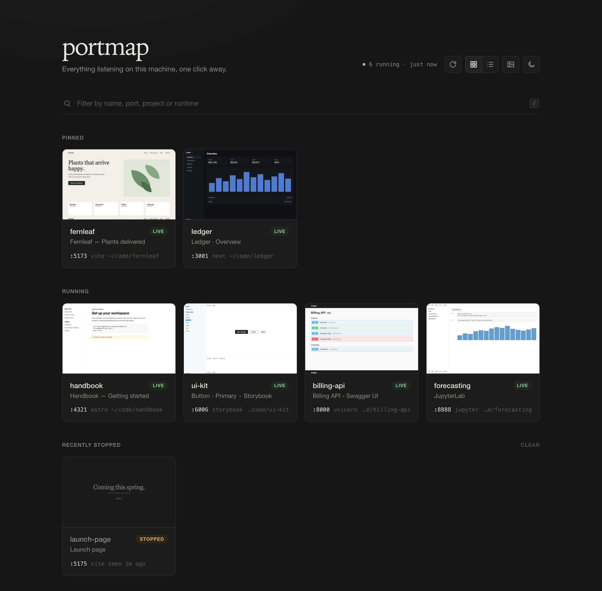
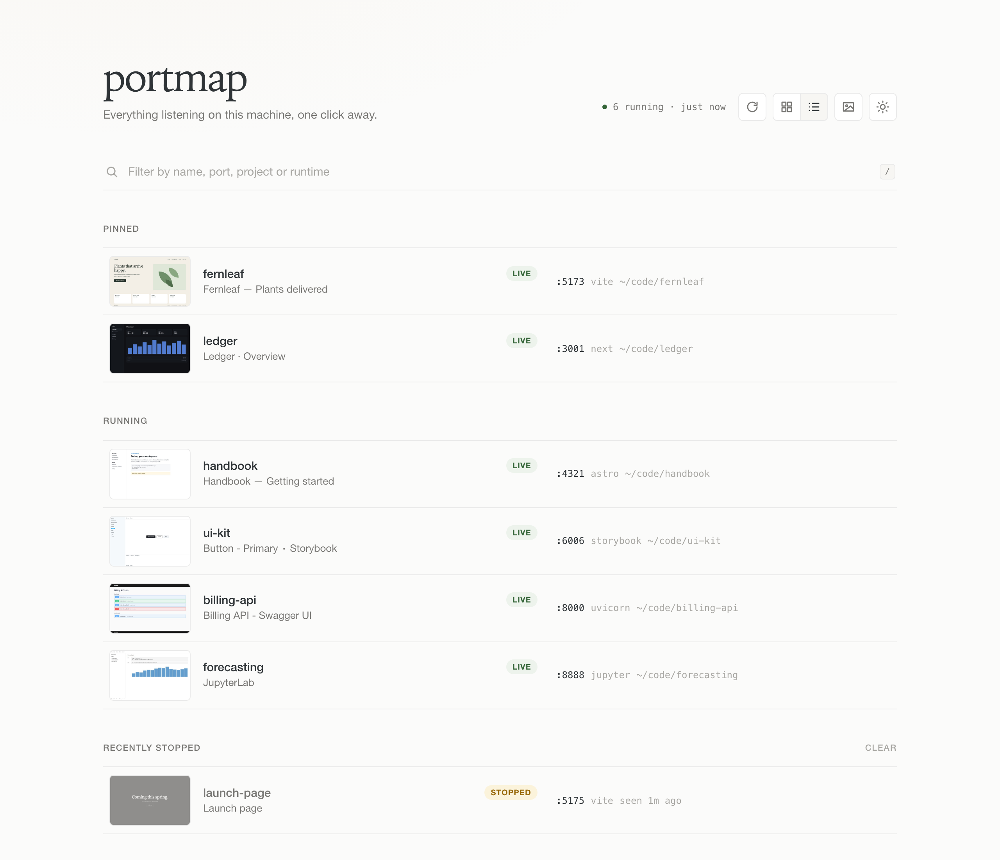

# portmap

A bookmark page for everything listening on localhost. portmap finds your running dev servers,
labels them by project and page title, takes a small screenshot of each, and gives you one page
to click through. It lives at **http://localhost:7878**.





<sub>Screenshots use demo projects.</sub>

- **Auto-discovers** HTTP services on every port above 1024 (via `lsof`). Labels come from the
  process's working directory (nearest `package.json` / `Cargo.toml` / `.git` …) and the page `<title>`.
- **Keeps itself clean.** New services appear within seconds. Stopped ones are marked
  *stopped*, then removed along with their cached thumbnail after 10 minutes. Pinned services
  stay as bookmarks and show as *offline*.
- **Thumbnails** come from the Chrome / Brave / Edge you already have, run headless one capture at a
  time, then shrunk to a ~30 KB JPEG. They are retaken when a service restarts, its title changes,
  you press refresh, or they are 15 minutes old while you're looking.
- **Pin, rename, hide** any entry. Databases, desktop-app internals (Raycast, editors, …) and APIs
  without a project that answer `/` with 4xx go under a collapsed *Other listeners* list, and you can
  pin any of them to make a card.
- **Manual refresh** button (or press `r`) rescans and re-probes everything immediately.
- Grid or list view, thumbnails on or off, and dark (default) or light theme, all remembered per browser.

## Why it's light

- One ~800 KB native binary (Rust, `tiny_http` + `serde`), using **~3–4 MB RAM and ~0% CPU** when idle.
- Scans every 3 s only while a portmap tab is visible, and every 30 s otherwise. The page stops polling
  when hidden, and unchanged state is a `304` with an empty body.
- HTTP probes are cached per (port, pid), so your dev servers aren't flooded with requests. A port is
  re-probed only when its process changes, or once a minute while you're watching.
- No Docker, no Node runtime, no web fonts, nothing fetched from the internet.

## Install (macOS)

### Homebrew

```sh
brew install rakshithbhat03/tap/portmap
brew services start portmap   # starts at login, restarts on crash
open http://localhost:7878
```

Homebrew 6.0+ only loads formulae from third-party taps you've [trusted](https://docs.brew.sh/Tap-Trust).
Installing by the full name above trusts just the `portmap` formula, not the rest of the tap. If you
tapped first and want to install by short name, trust the formula yourself:

```sh
brew tap rakshithbhat03/tap
brew trust --formula rakshithbhat03/tap/portmap
brew install portmap
```

After `brew upgrade portmap`, run `brew services restart portmap`. Logs go to
`$(brew --prefix)/var/log/portmap.log`. Use either `brew services` or `portmap install` below, not
both; they would compete for the same port.

### From source

```sh
cargo install --path .     # builds and puts `portmap` in ~/.cargo/bin
portmap install            # launchd user agent: starts at login, restarts on crash
open http://localhost:7878
```

`portmap install` writes `~/Library/LaunchAgents/dev.portmap.plist`, which runs the binary at a lower CPU
priority. Run `portmap uninstall` to remove it. After rebuilding, run `portmap install` again to restart
the agent on the new binary.

To run it in the foreground without launchd:

```sh
portmap            # same as `portmap serve`
```

Linux works too (needs `lsof`). Run `portmap serve` from a systemd user unit; `install` is macOS-only.

## Usage

| Action | How |
| --- | --- |
| Open a service | click its card |
| Filter | `/`, then type; `Enter` opens the first match, `Esc` clears |
| Rescan now | refresh button or `r` |
| Grid / list view | header toggle, or `g` / `l` |
| Show / hide all thumbnails | header toggle or `t`. While off, portmap launches no browser at all |
| Set a layout from a bookmark | `http://localhost:7878/?view=list&thumbs=off&theme=light` |
| Pin / rename / retake thumbnail / hide | hover a card |
| Reorder pinned items | drag and drop (grid or list), or focus one and press `Alt` + arrow keys |
| Forget a stopped service | hover it, then **×** |
| Clear all stopped services | **Clear** beside *Recently stopped* |

## Configuration

| Env var | Default | |
| --- | --- | --- |
| `PORTMAP_PORT` / `--port` | `7878` | UI port |
| `PORTMAP_HOME` | `~/.portmap` | state (`state.json`), thumbnails, log |
| `PORTMAP_STALE_MINUTES` | `10` | how long stopped services linger |
| `PORTMAP_BROWSER` | auto | Chromium-family binary for thumbnails |
| `PORTMAP_NO_THUMBS=1` | off | disable thumbnails entirely |
| `PORTMAP_ALLOWED_HOSTS` | none | comma-separated extra `Host` names to accept; `.example.com` accepts every name under it |
| `PORTMAP_TAILSCALE` | auto | `tailscale` CLI path, or `off` to disable tailnet links and sharing |

To use env vars with the launchd agent, add an `EnvironmentVariables` dict to the plist.

### Reaching portmap over Tailscale

portmap stays bound to loopback; let Tailscale Serve proxy to it:

```sh
tailscale serve --bg 7878     # tailnet only; never use `tailscale funnel`, which is public
open https://<machine>.<tailnet>.ts.net
```

When the `tailscale` CLI is available (on PATH, in `/usr/local/bin`, `/opt/homebrew/bin` or the
Tailscale app bundle), portmap reads this machine's tailnet name, accepts it and any other
`*.<tailnet>.ts.net` name as a `Host` without a `PORTMAP_ALLOWED_HOSTS` entry, and works out a tailnet link for every web service:

- Services listening on all interfaces (`*`, `0.0.0.0`) link to `http://<machine>.<tailnet>.ts.net:<port>`.
- Services listening only on loopback can't be reached from other devices. Hover the card and press
  the **share on tailnet** button: portmap runs `tailscale serve --bg --https=<port> http://localhost:<port>`
  and the card links to `https://<machine>.<tailnet>.ts.net:<port>`. Press it again to run
  `tailscale serve --https=<port> off`. Sharing is tailnet-only, never Funnel, and the mapping
  outlives portmap until you unshare it (`tailscale serve status` lists them). Only this machine
  and the node's owner (by Tailscale identity) can share; other tailnet users get an error.
- Mappings you created yourself are used for links but never removed by portmap.

Opened from `localhost`, cards keep linking to `http://localhost:<port>`. Opened through the tailnet
name, they use the tailnet links. Dev servers that check the `Host` header reject the tailnet
name until you allow it, e.g. Vite's `server.allowedHosts: ['.ts.net']`.

Anyone on your tailnet who can reach the machine can then see and edit pins, names and hidden
entries. Undo with `tailscale serve --https=443 off`.

For a separate hostname instead of the machine's own, run a Tailscale sidecar container that
proxies to portmap on the host (needs Docker Desktop, for `host.docker.internal`):

```sh
docker compose -f compose.tailscale.yaml up -d
docker compose -f compose.tailscale.yaml logs tailscale   # first start: open the login URL once
```

The node is named `portmap` (override with `TS_HOSTNAME`). portmap accepts any name under your
tailnet's MagicDNS suffix, so `https://portmap.<tailnet>.ts.net` works without
`PORTMAP_ALLOWED_HOSTS`. Card links and sharing still use the host machine's own Tailscale, so it
must be on the tailnet too. Remove it with `docker compose -f compose.tailscale.yaml down -v`
and delete the machine in the Tailscale admin console.

## Security

The server binds to `127.0.0.1` only and rejects requests whose `Host` header isn't
`localhost`/`127.0.0.1`/`[::1]` on its own port (plus names under this machine's tailnet and any
names you list in `PORTMAP_ALLOWED_HOSTS`),
which blocks DNS rebinding. Mutations require a JSON content type and a same-origin `Origin` header. portmap only reads the processes it observes and
never signals, kills, or starts them (apart from its own headless browser for thumbnails).

## Layout

```
src/scan.rs      lsof / ps / cwd discovery, raw HTTP probe, project + runtime labels
src/scanner.rs   adaptive scan loop, probe cache, thumbnail scheduling
src/store.rs     entries, lifecycle (live → stopped → removed), persistence, view versioning
src/thumbs.rs    headless-browser capture worker
src/server.rs    HTTP API + static UI, host/origin guards
src/tailnet.rs   tailnet name, `tailscale serve` mappings, share / unshare
src/launchd.rs   install / uninstall the user agent
assets/          index.html, style.css, app.js (no build step, embedded into the binary)
```

## Development

```bash
cargo test                                  # ~1s, no network or browser needed
cargo clippy --all-targets -- -D warnings
cargo fmt --check
```

Tests live next to the code they cover (`#[cfg(test)] mod tests` in each file). Probes and the HTTP
API are exercised against real sockets on ephemeral loopback ports, thumbnail capture against a stub
"browser" script, and persistence against throwaway directories; shared fixtures are in
`src/testutil.rs`. Nothing touches `~/.portmap` or probes the services running on your machine.
CI runs the same three commands on every pull request.
